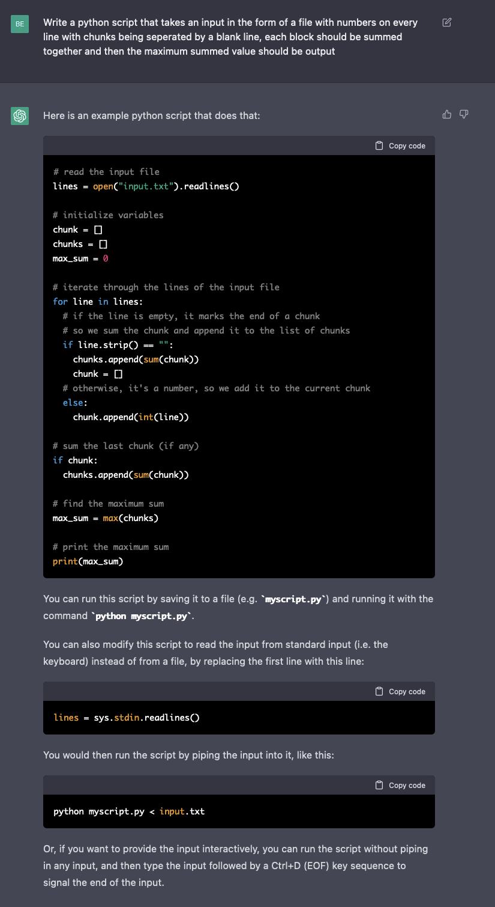
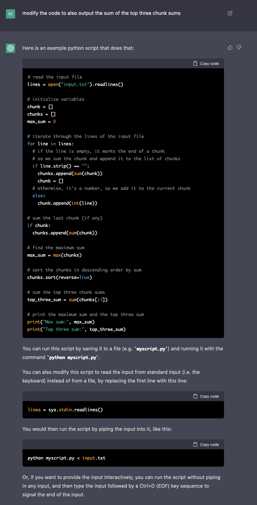

I wanted to see what would happen if I got OpenAI's [ChatGPT](https://chat.openai.com/chat) to write a solution to Day 1.

It worked.

Here's the chat log with the bot and the resulting outputs from the script vs my script:





```py
day1.py
70509
208567

OpenAI_ChatGPT_Solution.py
Max sum: 70509
Top three sum: 208567
```